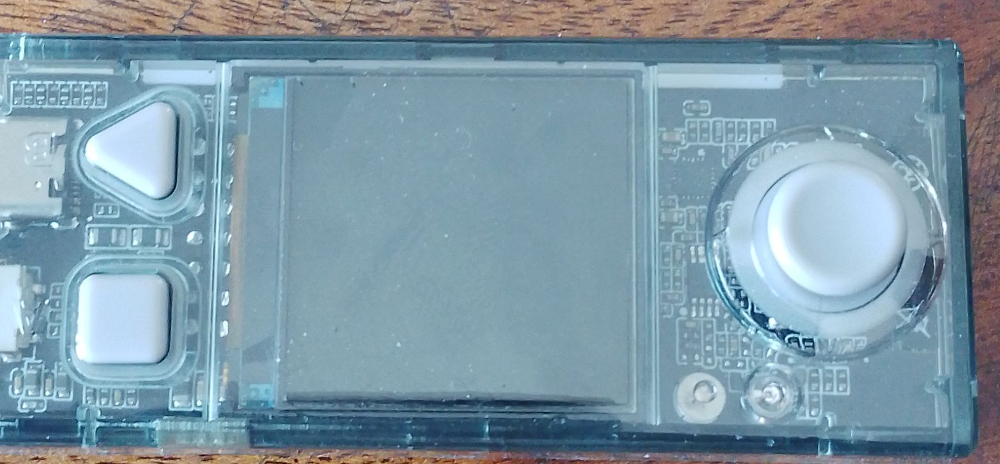

# PRESENTATION
il s'agit bien d'une presentation des formateurs et du programme de la journée suivis du contrôl de presence

## Le premier atélier était consacré à la cyberPi et l'ecosystème du mBuild

on eu identifier les composants du cyberPi et les principaux modules mBuild, à identifier un capteur d'un actionneur.
voici l'image d'un cyberPi 

### Le deuxième atélier était consacré au modèle 3D au G-C0de

 on a eu a modeliser un petit cube avec les paramètres bien définis

 ### le troisième atélier était consacré à une manipulation

 il était question de fabriquer une carte de visite et de l'imprimer.cette impression necessite trois paramètres:la  puissance du laser ;la vitesse et le nombre de passage de la tête du laser,plus la puissance est élevée plus la vitesse est lente et vice-versa.

 
 #### tâches accomplies

 j'ai pu modeliser la carte de visite mais avec des erreurs au début

 ### ce que je n'ai pas pu fait 

 je n'ai pas pu imprimé

