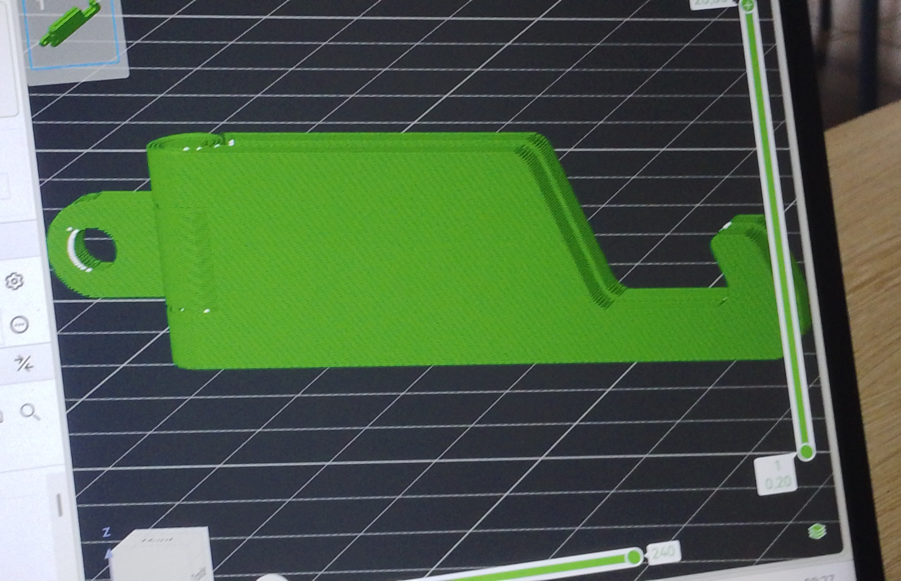
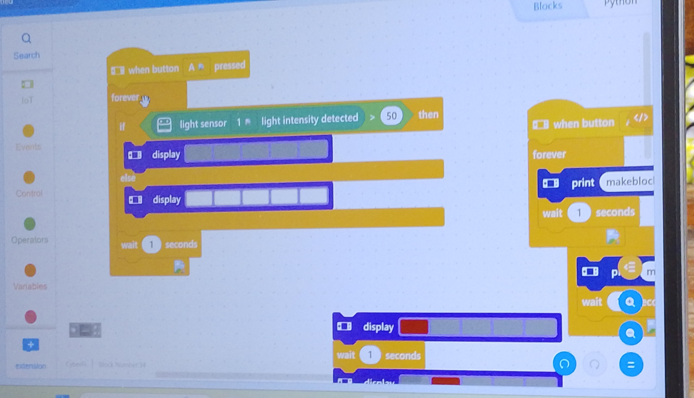

## journal du 28 août 2026

### SUite de l'impression 3D

on a eu à faire un paramètrage et impression 3D d'un modèle avec le logiciel  
l'image est la suivante
## Deuxième atlier
on a eu à faire le codage  à partir du CyberPi comme l'indique  l'image suivante 

## troisième atélier:élaboration d'un projet 

la synergie entre le design thinking associe l'approche centrée sur l'utilisateur et créative du design thinking à la gestion rigoureuse des risques et au developpement itératif du modèle en spirale.cette synergie passe par les étapes suivantes:déterminer les objectifs (empathie et définition);évaluer les risques et idéer(idéation);développer,prototyper et tester(prototypage et test)et planifier le prochain cycle.