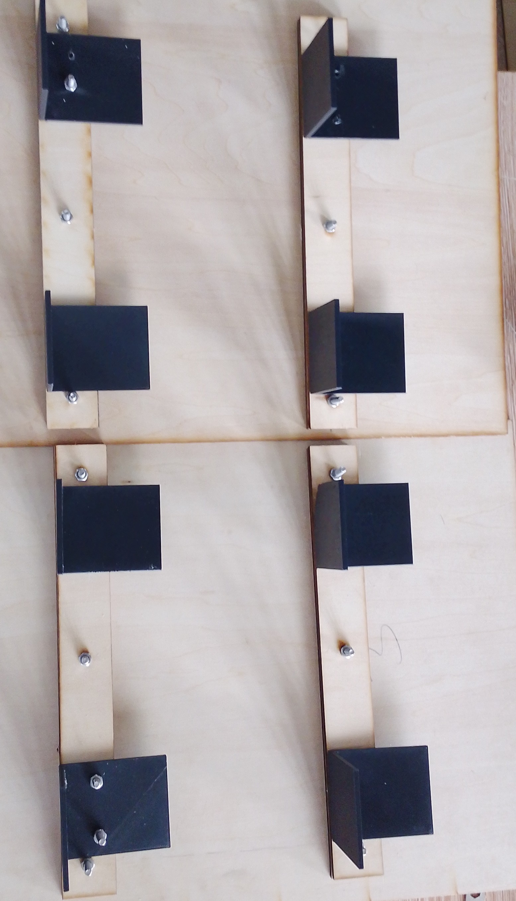
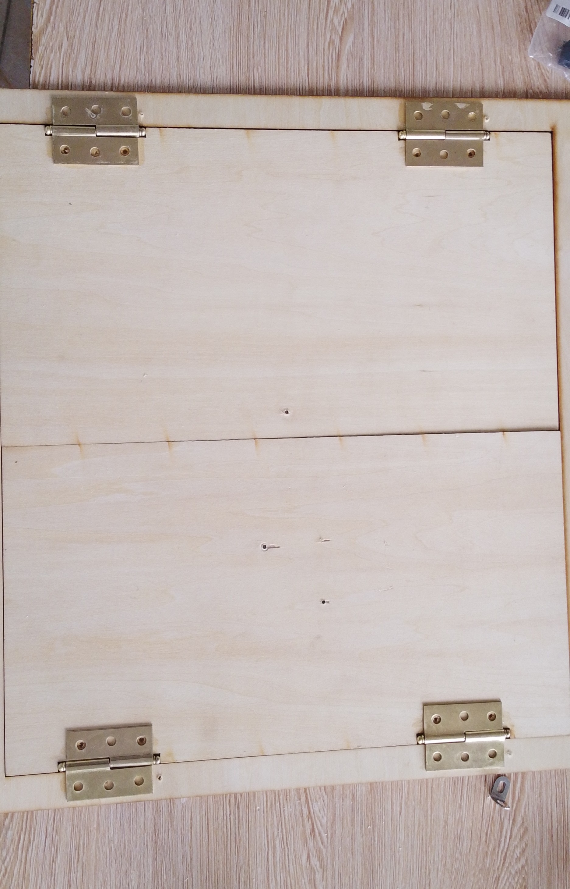
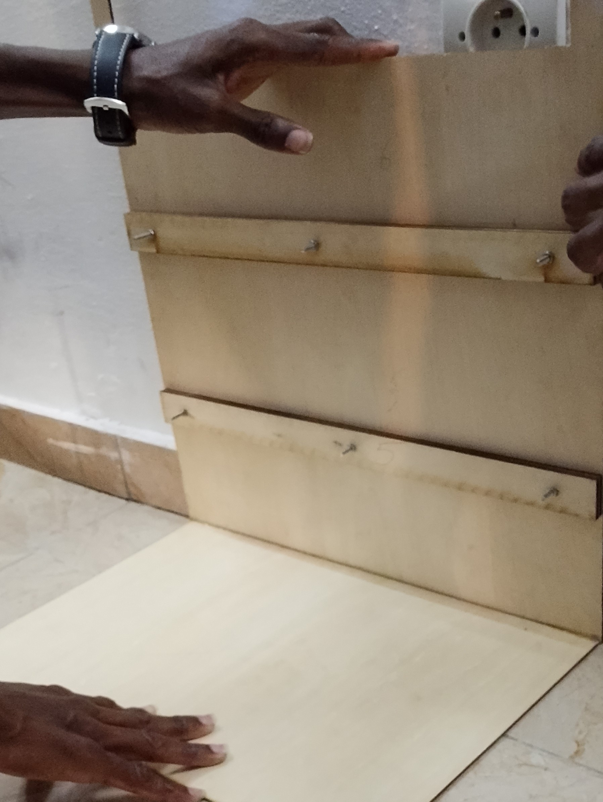
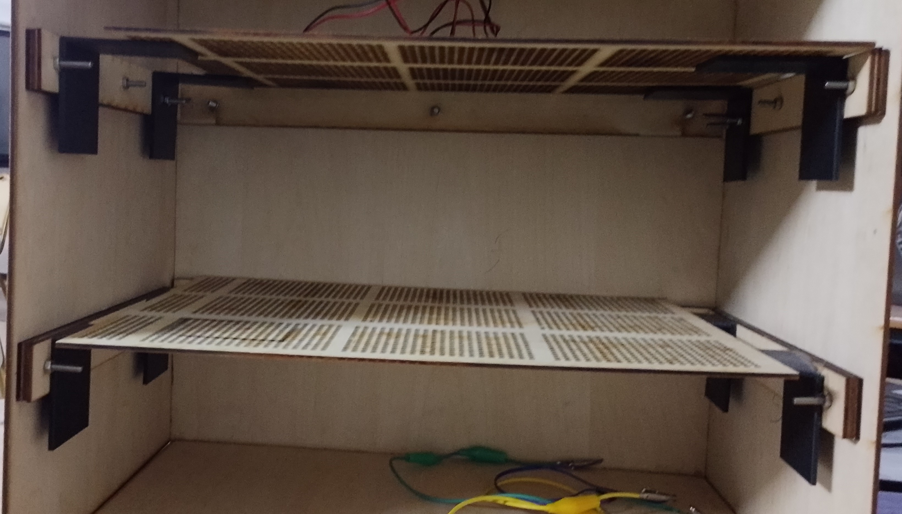

## journal du 15 septembre 2026 Rédigé par ADJANLA Hodabalo
- **ce que on a fait**:nous avons placé les supports de grilles comme l'indique l'image ci-dessous
Ensuite nous avons placé les paumelles sur les portes comme l'indique l'image ci-dessous
Après nous avons collé notre deshydrateur comme les photos l'indiquent ci-dessous

En fin nous avons fait le programme pour le jour suivant
signé ADJANLA Hodabalo