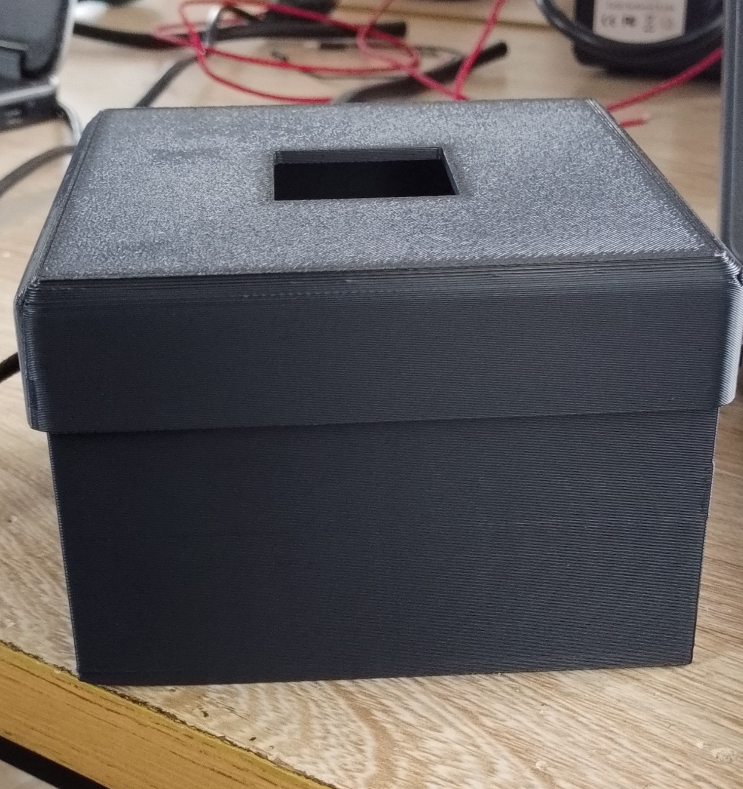
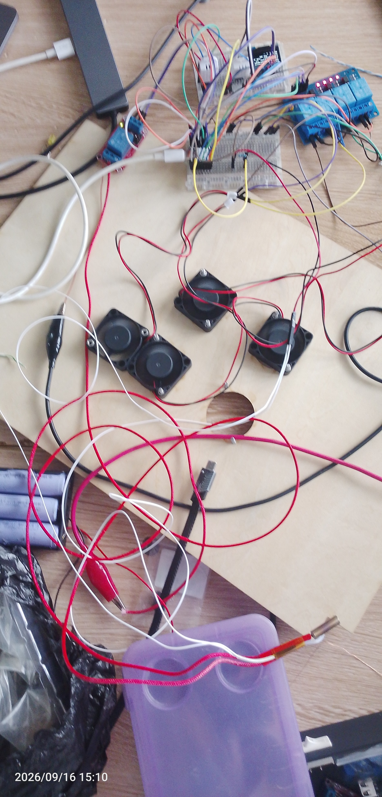
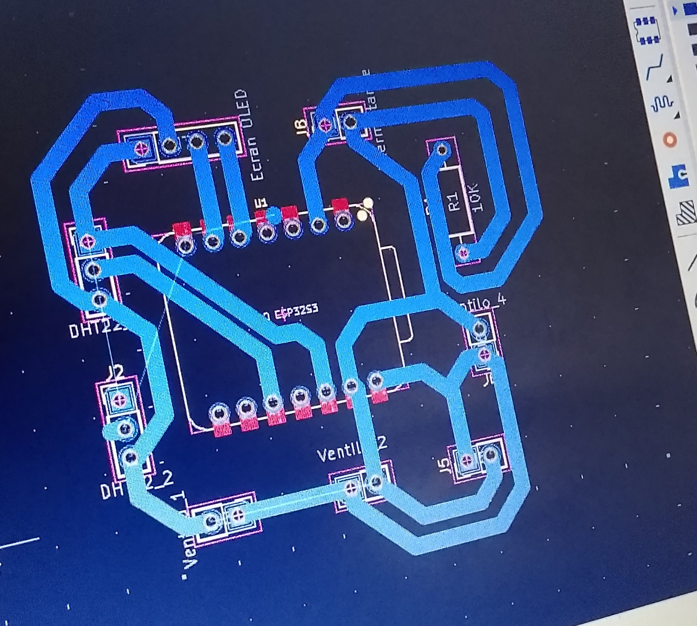

## journal du 16 Semptembre 2026 rédigé par ADJANLA Hodabalo
Nous avons commencé par une programmation de tous ce que nous allions  faire tout au long de la journée
- **ce que nous avons fait**:nous avons imprimé la boîte pour notre PCB et d'autres composants comme l'indiquent les photos ci-dessous

Nous avons testé notre resistance chauffante qui nous fournira la chaleur.
Voici l'mage de ce circuit
Ensuite nous avons testé nos deux capteurs comme l'indique la photo ci-dessous 
 nous avons commencé par concevoir le pcb que nous avons terminé le lendemain ,voici l'image dont je parle
 