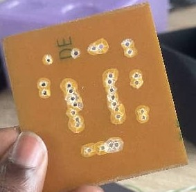
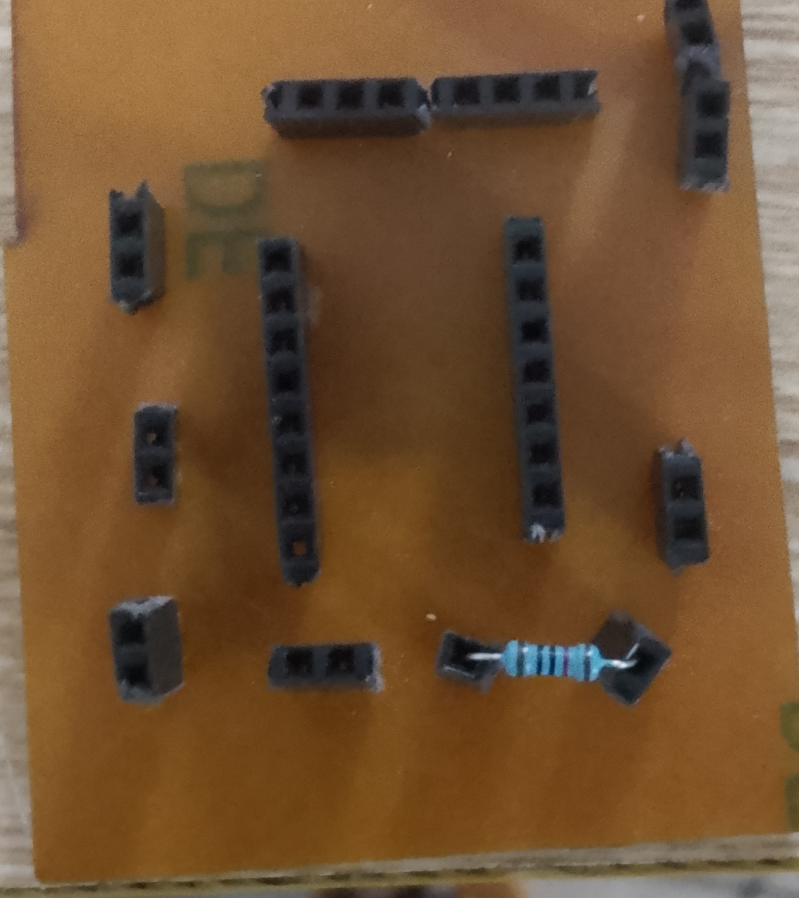
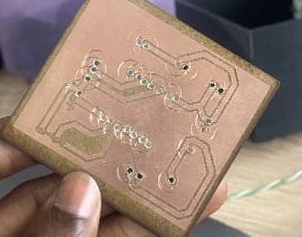
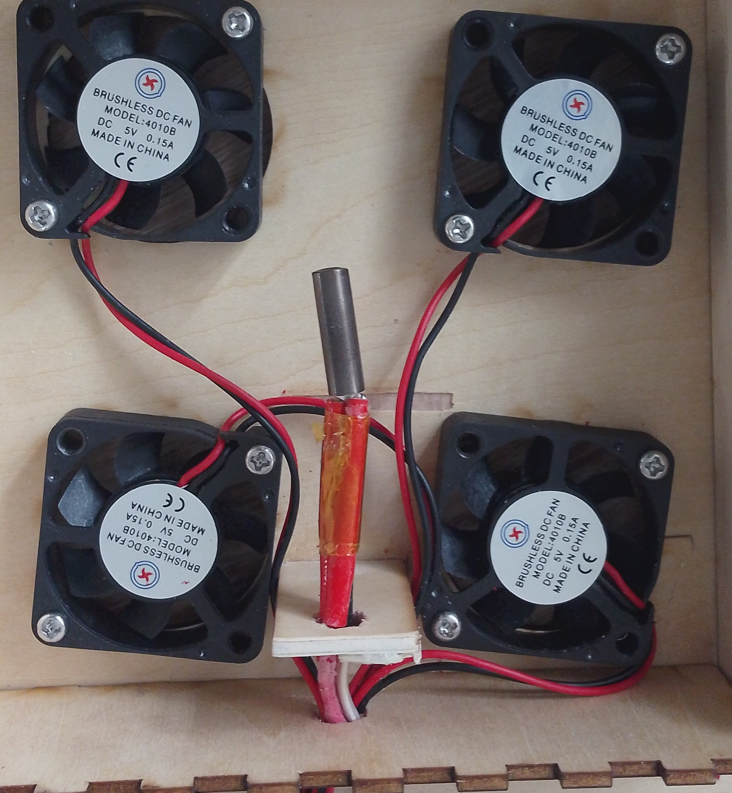
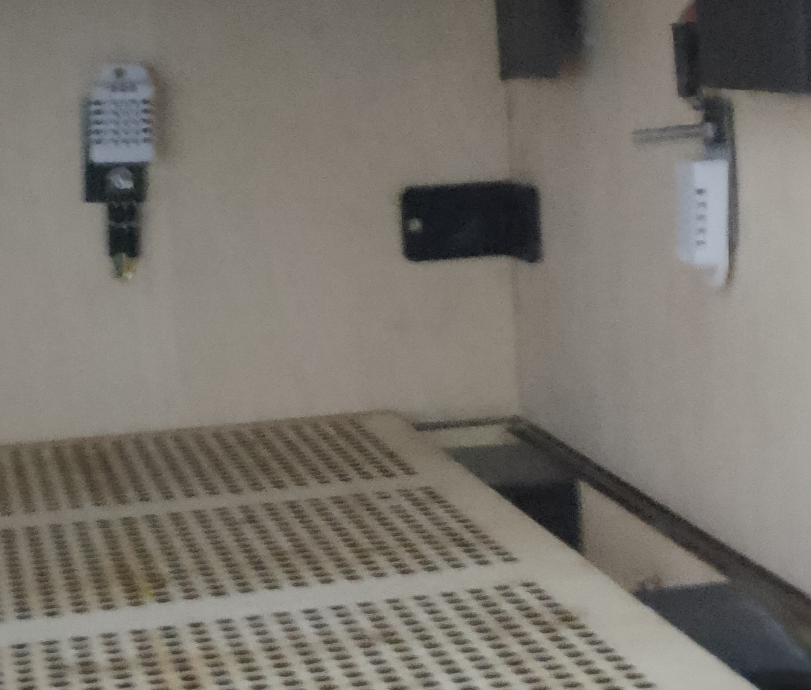

## journal du 17 septembre 2026
Nous avons commencé la journée par le planying,ensuite nous avons terminé et imprimé notre pcb comme l'indiquent les photos ci-dessous
Ensuite nous avons placé notre resistance chauffante comme l'indique l'image ci-dessous  
Après nous avons placé nos capteurs dans notre déshydrateur comme l'indique l'image ci-dessous
- **erreurs commises**:nous avons raté notre PCP mais nous avons récommencé,nous avons aussi raté le boîtier pour mettre les composants mais nous l'avons fait de nouveau.Nous avons replacé les ventirads puisqu'on avait mal placé .
Nous avons eut des problèmes pour le cablâge aussi.
signé ADJANLA Hodabalo
