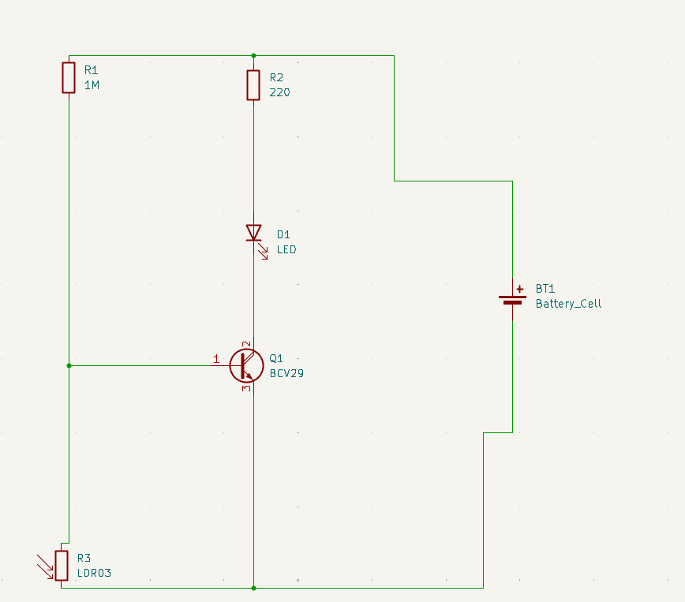
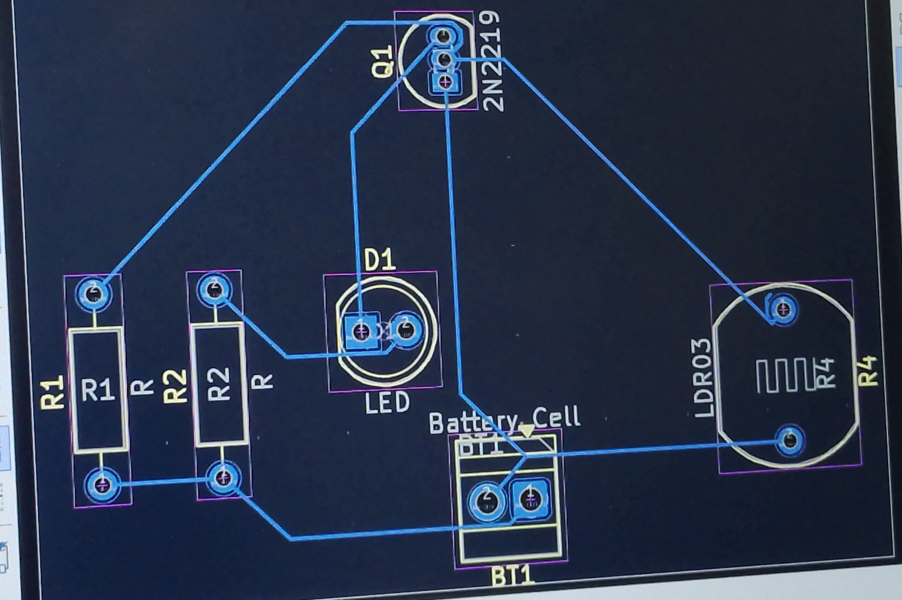
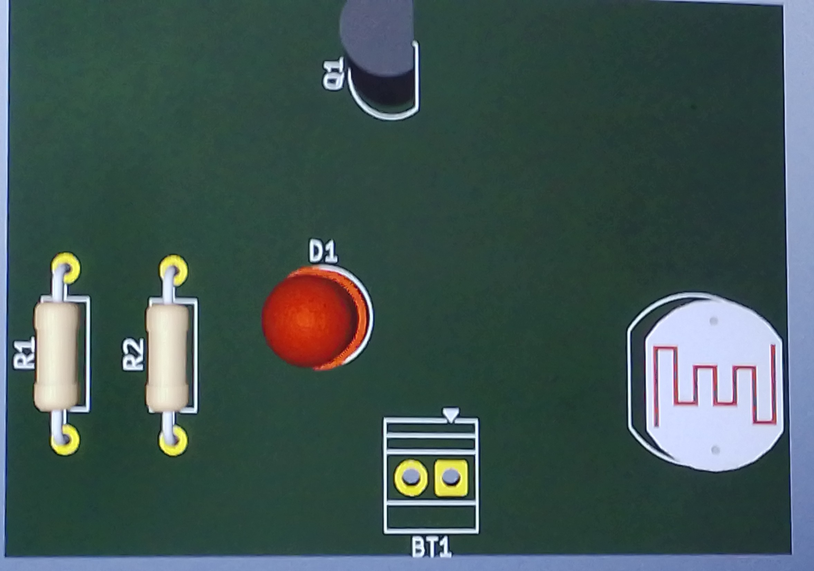

## journal du 07 septembre 2026
-**Atélier PCB:de l'idée au circuit imprimé**
ce que on a fait :on a suivi le cours sur l'initiation aux PCB,on a eudié l'anatomie d'un PCB,on a appris à lire les symboles des composants électroniques sur un schéma ,on a appris la difference entre breadbord et PCB.
exemple de schéma électronique fait sur kicad 

Ensuite on a placé les composants sur une carte et tracé les pistes pour les rélier commeindique la figure ci-dessous

Après on à visualisé rendu 3D pour voir à quoi ressembléra la carte finale comme l'indique la photo ci-dessous

Cet atélier nous a permis de savoir comment passer d'un circuit sur papier à une carte électronique réelle qui peut être fabriquée .