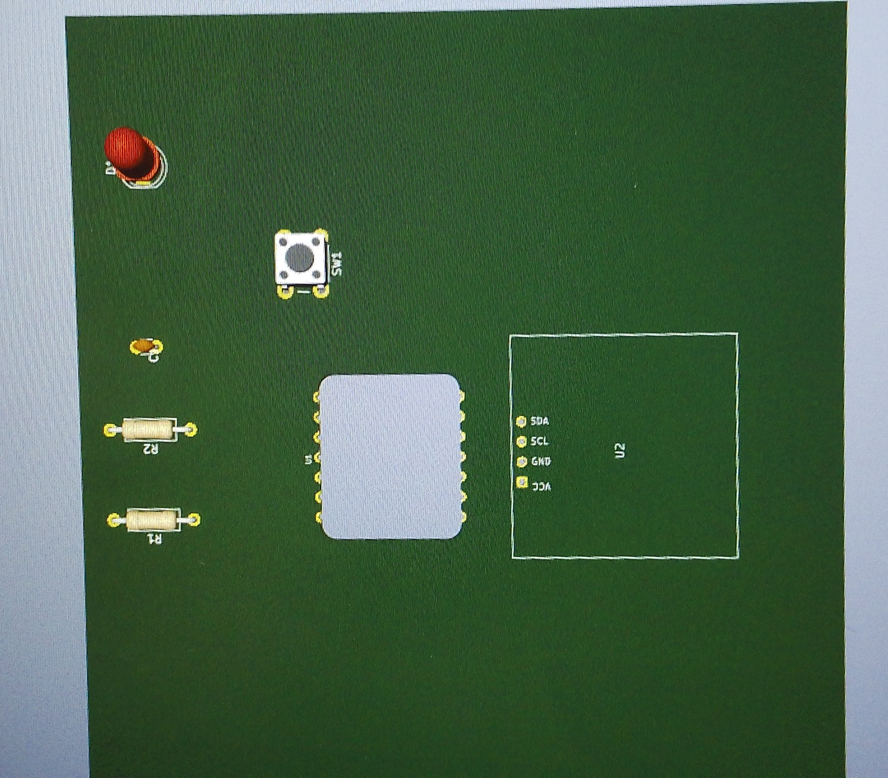

Journal du 09 septembre 2026

- **ce que on fait**: conception d'une carte électronique XiAO schéma et PCB sur Kicad.
On a utilisé le logiciel Kicad pour concevoir une carte électronique complète comme l'indique la photo ci-dessous
Ensuite on a placé tous les composants sur la carte comme l'indique la photo ci-dessous 
En fin on a fait l'introduction à la programmation et à l'informatique.on a vu les bases d'un programme notament ::les variables,les boucles,les fonctions,structures conditionnelles,les commentaires et les opérations.