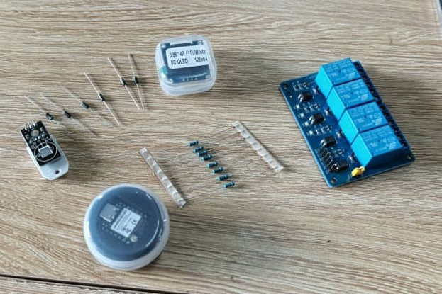

## journal du 10 septembre 2026 redigé par ADJANLA  Hodabalo

- **ce que on a fait** :Nous avons  fait l'inventaire du matériel electronique de notre  projet deshydrateur pour voir ce qui manquait. Voici l'image du materiel de notre projet disponible pour  le moment  .
- **ce que on a pas pu faire**:nous n'avons pas pu concevoir notre PCB par manque d'autres composants

