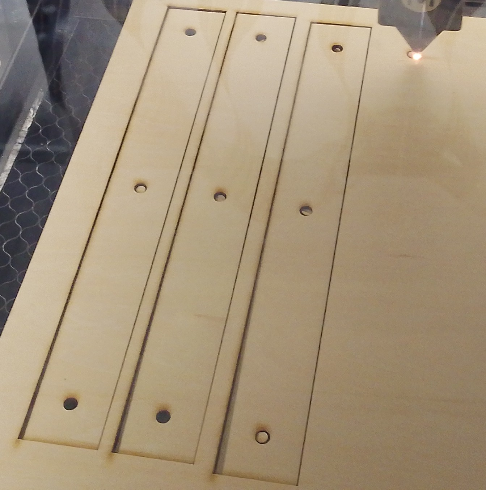
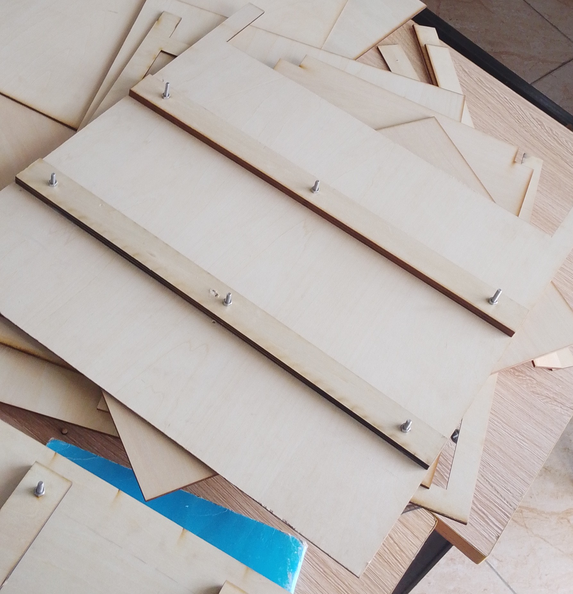

## journal du 11 septembre 2026 rédigé par ADJANLA Hodabalo

- **suite avec nos projets**: nous avons continué avec nos projets dans nos groupes.nous avons découpé les supports de plateaux pour notre séchoir comme l'indique l'image ci-dessous
Après découpe on a vicé et essayé de monter comme l'indique les images ci-dessous 

- **ce que on a pas fait**:on a pas pu finir de concévoir notre PCB ,on a pas pu resoudre le problème de notre porte du déshydrateur par manque des paumelles.