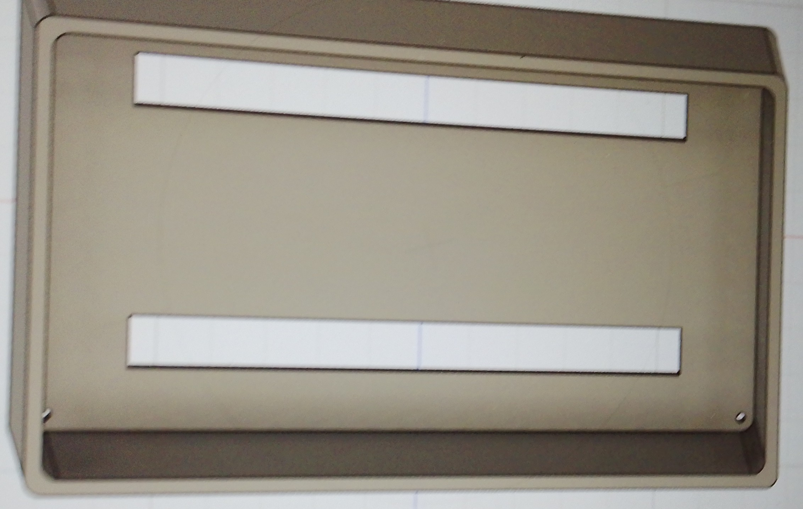

## journal du 12 septembre 2026 rédigé par ADJANLA Hodabalo
- **ce que on a fait**:
Nous avons modèliser  la moitié de notre boîtier comme l'indique la photo ci-dessous

Ensuite nous avons tester le ventirad et commencer par concevoir le PCB
