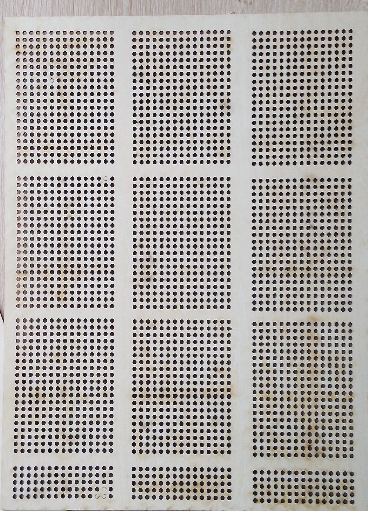

## journal du 14 septembre 2026 rédigé par ADJANLA Hodabalo
- **ce que on a fait**:nous avons modèliser et imprimer le poignet et la targette comme l'indique l'image ci-dessous.Ensuite nous avons fabriquer les grilles alimentaires comme l'indique l'image ci-dessous
Après nous avons percer les trous des ventirads comme l'indique l'image ci-dessous-**les erreurs commises**:nous avons  pris les dimensions des grilles alimentaires plus petites.
- **erreurs corrigées**: nous avons modèliser et imprimer des supports pour rémedier à ce problème comme l'indique l'image ci-dessousnous avons placer les ventirard comme l'indique l'image ci-dessous Ensuite nous avons simuler ces ventirads avec breadbord comme l'indique l'image ci-dessous
Signé par ADJANLA Hodabalo